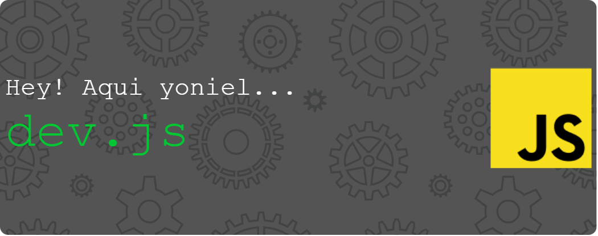

---
---

## `Hey bro!`

---

### _Bienvenid@ a mi perfil._

Soy un noob que disfruta aprendiendo programación. Empecé a estudiar por mi cuenta en `2023`. Empecé con **HTML** y **CSS**, pero ahora busco aprender herramientas como **Docker** y **NGINX**. Saludame
---
---
### Ya he trabajado con estas:

---
---
## `console.log("Hello World!")`

    

| Aun aqui..
